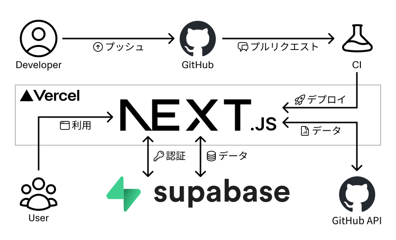

<div align="center">
    
</div>

## サービス概要

このサービスはエンジニア向けのプロフィール作成・公開サービスです。  
面倒な設定不要で GitHub の情報を元に **"イイ感じ"** にプロフィールを作成することができます。  
また、スキルや経験プロジェクトの設定を行うことで、職務経歴書としても機能するようなサービスを目指して開発を進めています。

## プロジェクト管理

GitHub Projectsを使用して、Issueベースでタスク・情報・工数の管理をしています。

- [カンバンボード](https://github.com/users/tzptzptzptzptzp/projects/4/views/1)

## インフラ構成図

<div align="center">
    
</div>

## ドキュメント

### 要件

- [要件定義](./docs/requirement/要件定義.md)

### 運用

- [コミット](./docs/operation/コミット.md)
- [ブランチ](./docs/operation/ブランチ.md)
- [リリース](./docs/operation/リリース.md)

### 構造

- [ディレクトリ構成](./docs/structure/ディレクトリ構成.md)

### 設計

- [API 設計](./docs/architecture/api/README.md)
- [DB 設計](./docs/architecture/db/README.md)

### 仕様

- [機能仕様](./docs/specification/README.md)

### 画面

- [画面設計](./docs/screen/画面設計.md)

### 使用技術

- [使用技術](./docs/technology/README.md)

### テスト

- [テスト](./docs/testing/テスト.md)

## 環境構築

<details>

### 前提条件

- Node.jsがインストールされていること
- npmまたはyarnが使用できること

### 手順

1. **リポジトリをクローン**

   ```bash
   git clone https://github.com/tzptzptzptzptzp/profile-service.git
   cd profile-service
   ```

2. **依存関係のインストール**

   ```bash
   npm install
   # または
   yarn install
   ```

3. **環境変数の設定**

   `.env.sample`ファイルをコピーし、`.env`ファイルを作成します。

4. **開発サーバーの起動**

   開発サーバーを起動し、アプリケーションが正しく動作することを確認します。

   ```bash
   npm run dev
   # または
   yarn dev
   ```

   ブラウザで `http://localhost:3000` を開き、アプリケーションが表示されることを確認します。

5. **ビルドと本番サーバーの起動**

   アプリケーションをビルドし、本番環境でテストします。

   ```bash
   npm run build
   npm start
   # または
   yarn build
   yarn start
   ```
   
   `http://localhost:3000`でアプリケーションが動作することを再度確認します。

### 注意事項

- セキュリティ上、`.env`ファイルは必ず`.gitignore`に追加してください。
    
</details>

